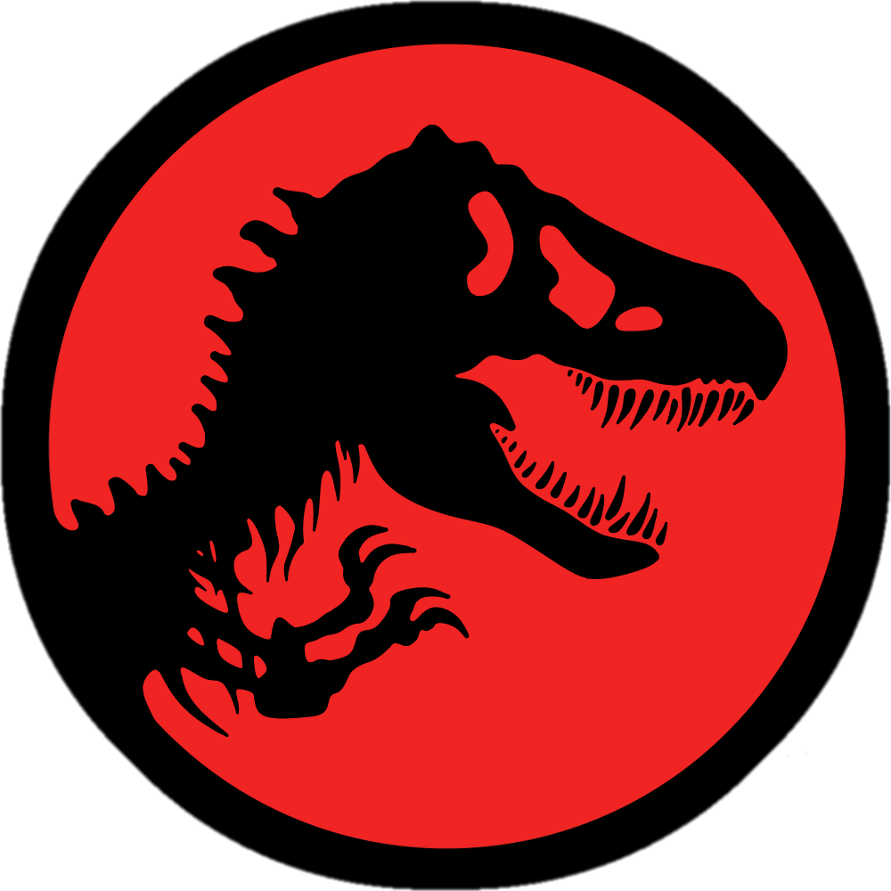

<a name="readme-top">

<br/>

<br />
<div align="center">
  <a href="https://github.com/johann122004/">
  <!-- TODO: If you want to add logo or banner you can add it here -->
    
  </a>
<!-- TODO: Change Title to the name of the title of your Project -->
  <h3 align="center">Seatwork 4</h3>
</div>
<!-- TODO: Make a short description -->
<div align="center">
  This project is a website designed to feature different types of design layouts that feature all kinds of features.
</div>

<br />

<!-- TODO: Change the zyx-0314 into your github username  -->
<!-- TODO: Change the WD-Template-Project into the same name of your folder -->


---

<br />
<br />

<!-- TODO: If you want to add more layers for your readme -->
<details>
  <summary>Table of Contents</summary>
  <ol>
    <li>
      <a href="#overview">Overview</a>
      <ol>
        <li>
          <a href="#key-components">Key Components</a>
        </li>
        <li>
          <a href="#technology">Technology</a>
        </li>
        <li>
          <a href="#deployment">Deployment</a>
        </li>
      </ol>
    </li>
    <li>
      <a href="#rule,-practices-and-principles">Rules, Practices and Principles</a>
    </li>
    <li>
      <a href="#resources">Resources</a>
    </li>
  </ol>
</details>

---

## Overview

<!-- TODO: To be changed -->
<!-- The following are just sample -->
Description of the project in details.

Guiding Question:
- What is the project
  - The project is the 4th seatwork in Web Design with Client Side Scripting.
- Whats the purpose
  - The purpose of the project is to educate in how to create a website that displays a product or an object with different types of features.
- What are key components
  - The key components that are used in this website are that it is a multi-page website, that it displays features of a product or an object, and simple animations such as the buttons in the header and the landing page.
- What technology used and how it is used
  - The technology that is used are HTML and CSS. HTML is used to makeup the main body of the website, while CSS is used to design the contents of the website.

### Key Components
<!-- TODO: List of Key Components -->
<!-- The following are just sample -->
- Multi-Page Website
- Features Website
- Animations

### Technology
<!-- TODO: List of Technology Used -->


### Deployment
#### Link:

https://johann122004.github.io/WD-Lopez-Seatwork-4/

## Rules, Practices and Principles
1. Always use `WD-` in the front of the Title of the Project for the Subject followed by your custom naming.
2. Do not rename any .html files; always use `index.html` as the filename.
3. Place Files in their respective folders.
4. All file naming are in camel case.
   - Camel case is naming format where there is no white space in separation of each words, the first word is in all lower case while the succeding words first letter are in upper followed by lower cased letters.
   - ex.: buttonAnimatedStyle.css
5. Use only `External CSS`.
6. Renaming of Pages folder names are a must, and relates to what it is doing or data it holding.
7. File Structure to follow below.

```
WD-ProjectName
└─ assets
|   └─ css
|   |   └─ style.css
|   └─ img
|   |   └─ fileWith.jpeg/.jpg/.webp/.png
|   └─ js
|       └─ script.js
└─ pages
|  └─ pageName
|     └─ assets
|     |  └─ css
|     |  |  └─ style.css
|     |  └─ img
|     |  |  └─ fileWith.jpeg/.jpg/.webp/.png
|     |  └─ js
|     |     └─ script.js
|     └─ index.html
└─ index.html
└─ readme.md
```

## Resources

<!-- TODO: Add References -->
| Title | Purpose | Link |
|-|-|-|
| Low Rank Armor | To act as a source for an image for one of the feature sections | https://www.ign.com/wikis/monster-hunter-world/Low_Rank_Armor |
| CSS background-position Property |for positioning the image as background for the features | https://www.w3schools.com/cssref/pr_background-position.php |
| Monster Hunter: World | To act as logo for the first feature page | https://logos.fandom.com/wiki/Monster_Hunter:_World |
| How to Install Mods in Half-Life | For source of the image for one of the feature sections | https://gamerant.com/half-life-how-install-mods/ |
| Half-Life could have been called Fallout or Crysis, developer reveals | For source of the image for one of the feature sections | https://hitmarker.net/news/half-life-could-have-been-called-fallout-or-crysis-developer-reveals-2380671 |
| Half-Life Multiplayer Screenshots | For source of the image for one of the feature sections | https://www.bluesnews.com/screenshots/hl/multiplayer/shot1.html |